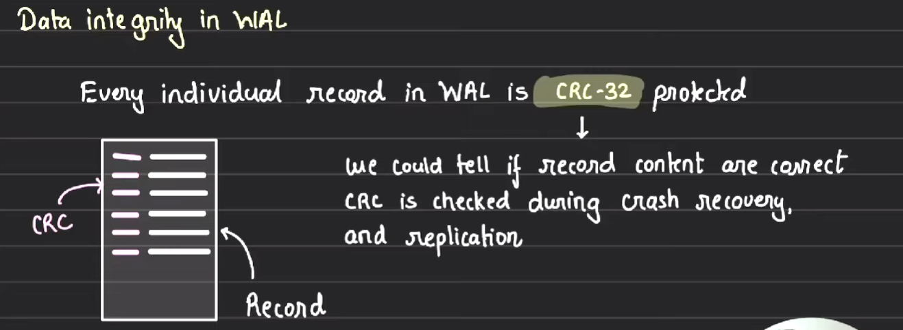
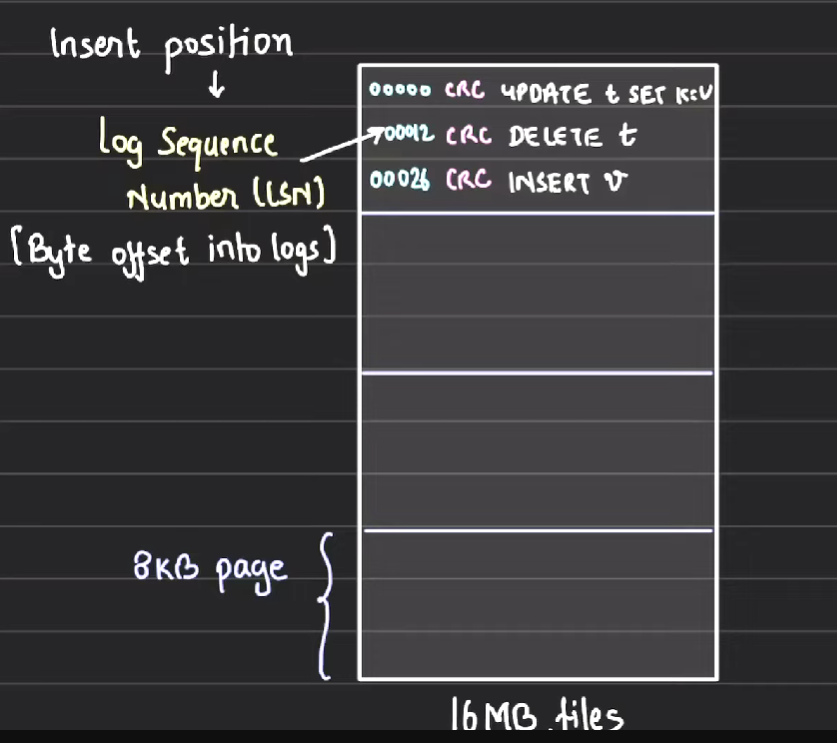
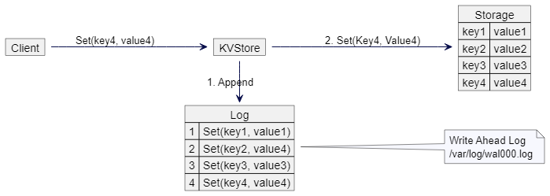

- Write ahead logging is a concept.
- It is append only , so its the lightening fast.
- It is used in database and other places as well.
- Also help in recovery and history checking.
- CRC protection

