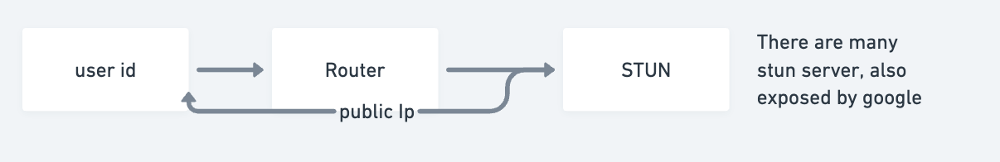
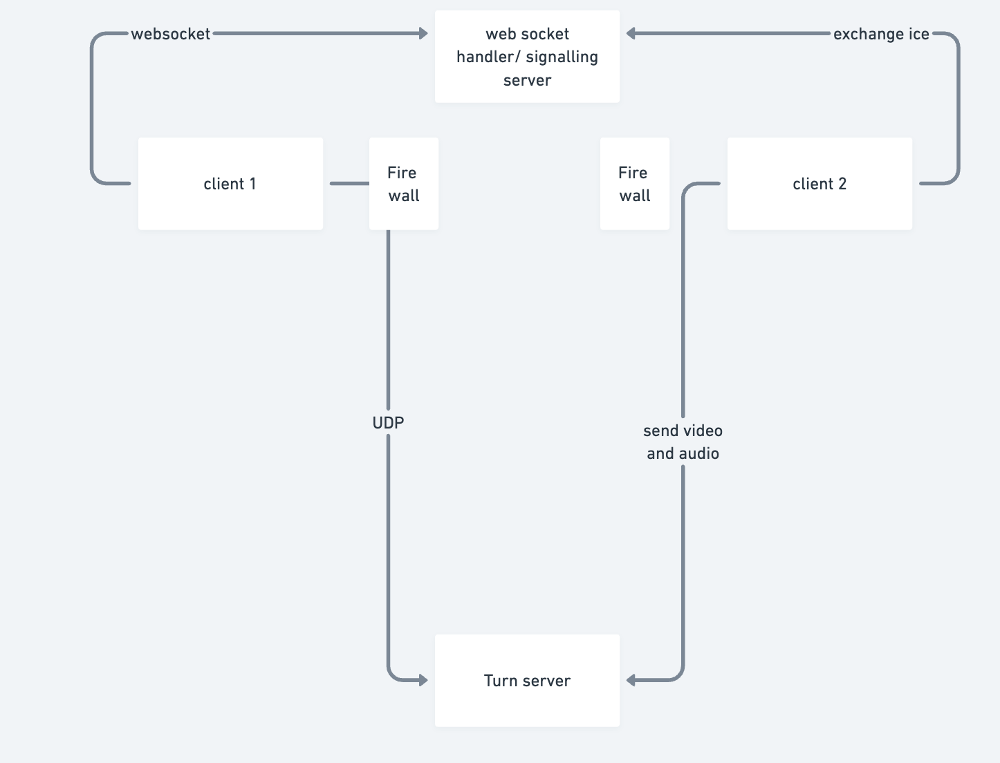
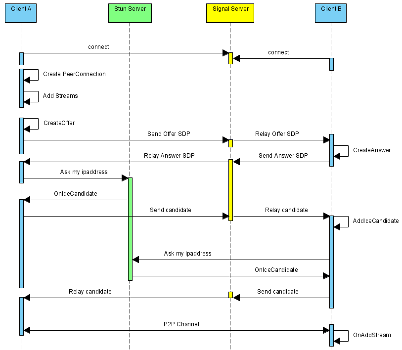

### Functional Requirements ( this is source of truth )
1. The system must support group calls
2. Should offer a call recording feature
Note: Screen share will be an extension of video call itself, only in case of video call the source of the video is the camera, whereas in screen share source of the video will be the screen.

### Non-Functional Requirements
1. Should be super fast - low latency is not enough
2. High availability
3. Data loss is OK


Estimations: 
- How many calls per second. 
  - daily: 50k
  - concurrent 1k;
- How many people in a group.
  - let say 500.
- Storage for recording:  

Entities:
- User, room, room_partiicipant, recording.

Api Design: 

1. api to create the room. 

```
/api/v1/room/       POST

Response: 
{
   roomId: <>
}

```

2. Join the room


```
/api/v1/room/{roomId}       POST

x-token -> verify user.

Request{}: 
Response: 
{
  userId: <>
  roomId: <>
  joinedAt: <>
}
```

3. create the websocket connection for a room at starting. 
```
api/v1/room/ws?room_id=ROOM_ID&user_id=USER_ID    ws type

for exchanging: 

{ "type": "offer", "payload": { /* SDP offer */ } } 
{ "type": "answer", "payload": { /* SDP answer */ } }
{ "type": "candidate", "payload": { /* ICE candidate */ } }

```
4. Leave the room
5. start recording.


Db schema: 

- User:
  - id, email, name..
- Room:
  - id,isactive, createdby, creationat ..
- RoomParticipant:
  - id, roomId, userId, jointtime, lefttime
- Recordings:
  - id, videoId, roomId, video_url, createdtime, createdby...


### High level design

In case of video call, User 1 continuously sends video chunks to User 2, and vice versa. Since some minor data loss is acceptable in video streaming, UDP is used because it is fast and provides low latency, which is essential for smooth video processing.

However, UDP requires both users to have public IP addresses to communicate directly. In reality, most clients are behind NATs (Network Address Translators) and only have private IP addresses. Therefore, clients don’t know their public IP address by default. To solve this, a STUN server is used. The STUN server helps a client discover its public IP address.

Once the public IP addresses are known, a peer-to-peer (P2P) connection can be established. Before this connection happens, a handshake process is required. This handshake is facilitated by another server called the signaling server, which is used only once to exchange necessary connection information. After signaling, users can establish a P2P connection and transfer audio and video data over UDP.

During the handshake, clients exchange ICE candidates (Interactive Connectivity Establishment). ICE candidates contain important information about the client, such as video quality preferences (HD/SD), IP addresses, and connection capabilities.

The signaling server is responsible for exchanging these ICE candidates and other metadata between clients.

Sometimes, P2P connections are not possible due to firewalls or security restrictions. In such cases, a TURN server is used. Both clients send their media streams to the TURN server, which relays the data to the other client. This ensures secure and reliable communication, even when direct P2P is blocked.

All of these mechanisms are part of the WebRTC protocol, which is widely used for video calling and video sharing applications.





Flow of two client usually: 




High Level Design and deep dive: 


#### Doubts:
- is this webrtc concept or what protocol ? like do we need to create stun, turn , signaling service or it comes inside of it ?
  - this is an api doc : https://developer.mozilla.org/en-US/docs/Web/API/WebRTC_API
  - it provide the interface and we have to fill that
  - you can assume it like it need a stun ,turn and signalling server and once we provider this and its implementation to ti then its start working. More can be deep dive once start developing.
- if so how we are doing group call ?


### Reference

1. https://www.100ms.live/blog/webrtc-turn-server
2. https://www.codekarle.com/system-design/Zoom-system-design.htm
3. https://medium.com/@anto.christo.20/understanding-web-real-time-communication-webrtc-d4cec5a43f2f
4. https://eytanmanor.medium.com/an-architectural-overview-for-web-rtc-a-protocol-for-implementing-video-conferencing-e2a914628d0e [ unread ]
5. https://github.com/junaidrahim/webrtc-session