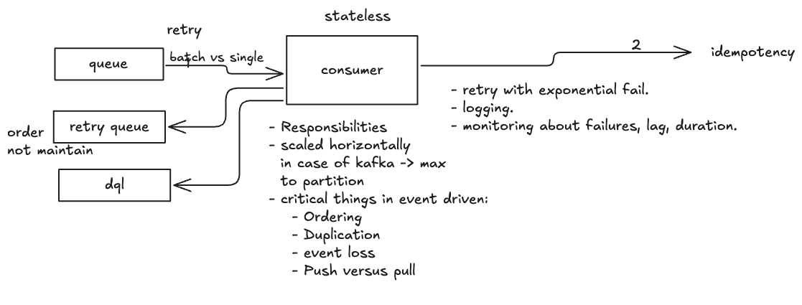
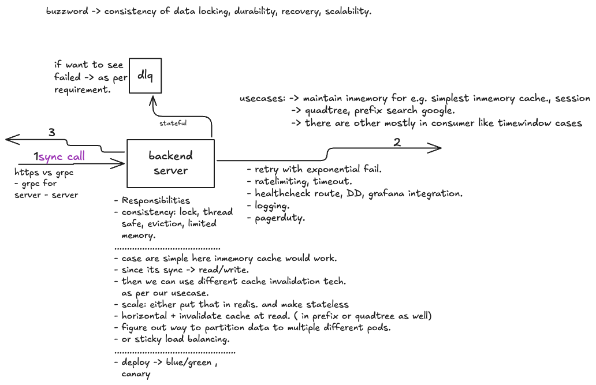
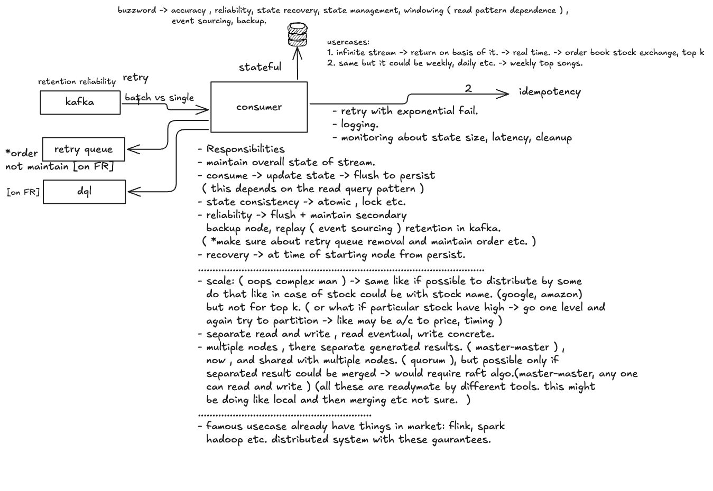
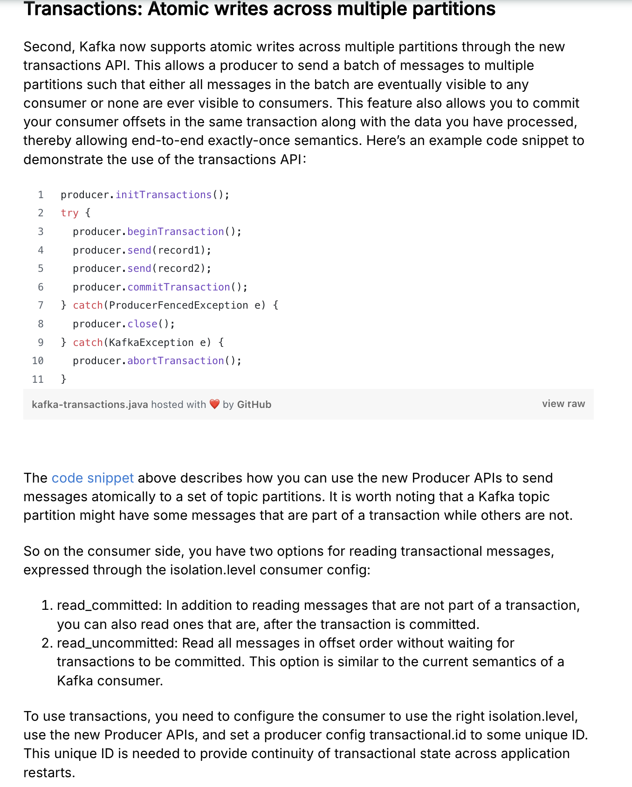
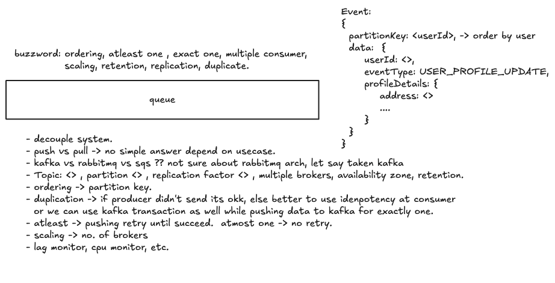

# High-Level Design (HLD) Interview Template (45 Minutes)

## 1. Requirements Gathering (5-10 minutes max)
- check time in middle , shouldn't invest more than 10 mins at max -> its a red red flag.

### 1.1 Functional requirements.
  - Clear the requirements and write it as functional requirements. 
  - clarify the doubts if have any, about requirements. 
  - write some out of scope requirements -> so that interview flag else they might cheat later on -> by saying i did say this or that. 
  - if require ask about the web page flow and ui by customer, like user come there will be a search tab it will click and write up the text etc. -> this will give idea different apis and different services.
### 1.2 Non functional requirements:
  - Discuss about non functional requirements. ( latency, availability, scalability, consistency,etc.).
  - Ask if they have any specific non functional requirements. 
  - Cap theorem in distributed system. 
### 1.3 Estimations: (ask -> let me know if you are not interested in this part, may be later on or at time of design we can come on this. Even they say not much invest time in calculations . ) 
  - Come on to esitmations. 
  - ask about the DAU. 
  - find the read qps.
  - ask about read: write ratio. 
  - find the write qps. 
  - ( 1 year = 400, 1 day = 10^5, 10^3 (K)(KB)(milli second (-ve)) , 10^6(M)(MB)(micro second (-ve)), .. B(GB)(nano), 10^3*B , (TB), ps)
  - Storage -> each row -> 500B, image -> 1KB -> find the 1 year.
  - usually storage ( MT rds) -> ~5OTB -> greater than this -> talk about partition , sharding.
  - find read heavy or write heavy.
  - find peak.
  - notice any specific constraints. ( like some system very less write, some have concurrent etc. )
  - if single digit latency , 5 thread -> 1k qps -> 1k8
  - kafka -> aws msk -> avg -> 50k-200k qps per broker -> as per instance. ( since 50MB / s -> 1 kb assume.)
  - redis -> micro second, sql -> single digit read, double digit write , cassandra -> read sql/s , write -> sql read.
  - transaction limit assume 1-10k at max.
  - mutex lock/unblock -> 100ns

## 2. System Design (10-15 minutes) ( sum -> 15 - 20) (20mins at max -> so total at max 25mins -> red red flag.)

### 2.1 High-Level Architecture

- Ask interview -> i usually draw boxes and do the api and db design. and then later on go into nfr like scaling, other details, let me know if any want to do have some other way. -> some can say first do api design and db design. then hld but mostly don't say any thing so continue. **Mostly prefer to have entities and  then most suitable api first then other things later on like hld db schema deep dive.** 
- Think about the solutions with past problem , Draw the boxes of different components, something new just draw boxes with some responsibility and later figure out in deep dive. 
- they can be different servers, gateway, database, kafka, elastic search, s3, graphql, client, CDN, redis, aws lambda, consumer, stream, batch ( only if multi country expensive)  etc just black boxes like database can be box as of now. b
- Draw the arrows -> to have high level idea of arrows. tell the flow one by one and make the arrow. 
- https, websocket, webrtc, sse, long polling, sse,  async, event driven, sync, grpc , graphql etc. 

- check the time.

### 2.2 API Design + database schema ( can also discuss Database type or may be later.).
- Go flow by flow and complete one flow -> then jump on the other. for example one flow is user service flow, other write flow, read flow etc. ( go by the highest priority to lowest )
- write the must have apis 
    - write its POST/GET etc. , 
    - api/v1/{domain}/{routename} , 
    - if GET write in query, POST write its json, 
    - write the request and response.
    - if require to have pagination add that.
    - if require to have cursor add that. ( always better to use cursor. )
    - talk about headers ( sone pe suhata.) -> token, jwt, saml , authid come there.
    - client -> graphql
    - server to server -> grpc
    - talk about different status codes -> 
        - 200: success , all good
        - 301: redirect to new url -> send this code and url.
        - 302: temporary redirect ->  mean we will come back on this like A/B testing etc.
        - 400: bad request, request is bad validation failed. 
        - 401: Unauthorized -> user needs to log in or authenticate to access the page.
        - 403: Forbidden -> server understood the request but won't fulfill it, due to a lack of permissions.
        - 404: Not Found -> server couldn't find the page requested ( might be incorrect url)
        - 500: internal server error , server broke.
        - 502: Bad Gateway -> This happens when one server, acting as a gateway or proxy, receives a faulty response from an upstream server.
        - 503: server unavaible -> not able to take request may be undeploy or down. 
        - 101: switching protocol.
    - **request meta , token, jwt token, saml**  -> for **authentication** , **header**  ( DIFF ), for websocket -> headers upgrade , key and version etc. -> res 101 switching protocol etc.
    

- write the db schema of that 
    - in mind think about the db, may be you can tell to interview thinking about this -> a/c to read heavy ( mysql , kv pair) or write heavy ( cassandra) with these questions -> what is data access pattern, what is query pattern, btree, lsm sst, columnar etc. -> more in db type deep dive. , or simply key value getting, or m:m relation graph, olap ( cassandra, snowflake datalake), vector db for embeddings, 
    - figure out the entities and write schema as per db.
    - write the structure, fields -> default -> id, createdtime, updatedtime. createdby, updatedby, globalcontextid , foreignId etc. 
    - write the type as well , but write the primary key and foreign key detail. 
    - mysql -> CHAR ( 0-255B), VARCHAR(0-64KB) -> both (can contain letters, numbers, and special characters) || TEXT -> string (0-64kB) , LONGTEXT(0-4GB) , TIMESTAMP (19731230153000 sample) , INT(4B), BIGINT(8B), BOOLEAN(1B), ENUM(variable) ... so on.
    - any specific contraint of field.
    - do as much normalised as possible. 
    - create as much as table as possible or as much as entities.
    - create 1:m , m:1, m:m relation drawing. 
    - though below one don't specificly showed primary, foreignkey or type of field. but this is for breaking.
    
    - this is mostly require for mysql , or document db, but generally work for all. 
    - Now ask interview do i have to invest more times on api and db design for other flows, or should i move on to details of flows and non functional requirements and scalabiltity. since i have less time. ? 
        - if yes -> do same for other flows. 
        - if yes-no -> just tell about the apis on high level or via text and db type and why. 
        - else move to next part. 
    - check the time don't invest more than ( 20mins at max -> so total at max 25mins -> red red flag.)
    

## 3. Deep Dive (15-20 minutes) (20-40) -> no limit until interviewer wants. ( 40mins-45 mins)

- This part basically , solve problem, let say if any algorithm remain like order book in stock exchange, window algo in rate limitings, consistency, orderering of events. trade offs, scaling, specific nfr etc done let's summarise and cover previous part or have mroe time discuss about the moniroting, logging, support system etc. Trade is ver very important -> means tell what are the option we have and which one you are choosing by doing some trade offs, error handling is ver very important, edge case handling ver very important, like consistency then how to make sure loss etc. 
- Ask interview which part they want to cover first and go in deep dive, -> if yes go into that. else below: 
- Telling the things below in order do them one by one , deep dive one and move to other. 
- Think about any end to end flow,  which you think important , then Do the dfs. Let say you have select some flow. Then go to client add details there , go the next component of flow add details there .... to end. Details are the below order wise.
- Tell the same to the interviewer

### 3.1 Order wide details -> could be possible for some component couldn't be possible for other. 

- When deep diving into any component, follow this systematic approach:

- Remeber these words -> Scalability, bottlenecks, Availability(after crash), Reliability(no loss), SPOF, Retry , error handling, consistency, concurrency, race condition, transaction, distributed complexity, backups, reconsilation, idempotency

- Let say first talk about client. ( like what would be happening on UI.)
    - say like UI will come on this page client on this. 
    - these are static pages -> via s3 or server -> CDN if high static caching backed by s3 or having multip customer.
    - say this will call to graphql. Not need to add much details. 
    - some time client do some work that can tell like file upload to s3 and send link to server etc.

    

- [Gate way](https://www.hellointerview.com/learn/system-design/deep-dives/api-gateway) -> let talk about this -> this is kind of statting point like app-gatekeeper. 
    - use it when you have a microservices architecture and don't use it when you have a simple client-server architecture.
    - tell particular route will get hit -> for e.g. /graphql , or may be direct api. 
    - it will send this route to particular server. 
    - say k8s can be used here -> like gate pay or load balancer high to the ingress of k8s then it will send to particular requests. 
    - tell bit about graphql -> why to use, request response, bff, dataloader etc. 
    - now this will call the backend server either via grpc or api.
    - also tell here like industry wide use k8s cluster so this need not to go to again via load balancer
    - scale graphql horizontally -> can tell -> k8s pods , replica count, hpa , service for load balancing etc can be used here
    - make secure by rate limiting, authentication (middle ware work)
    - request/response transformation -> header manipulation, payload modification

- For any general purpose server. ( sync called, stateless ):
    - is it https vs grpc vs websocket decide. etc. 
    - ask your self what's the responsibility of this server and wrote it
    - stateless -> scale horizontally depending upon qps, add loadbalancer ( service in k8s ) ( nginx (ingress) -> service (LB) -> pods (horizontal server)). -> available
    - what about hotspot  -> stateless shouldn't be case
    - Consistency and error handling , exponential retry, or dlq
    - or may be server level rate limiting, authentication, timeout
    - health checks endpoints, monitoring , logging and alertings
    - deployment strategy -> blue-green, canary, rolling updates
    - Ready-made solutions: AWS Lambda, Kubernetes Deployments, Google Cloud Run

-  for any general purpose consumer ( consuming async events):
    - consuming events via queue/kafka. 
    - write responsibility.
    - message processing -> batch vs single, error handling ( like retry or not.)
    - some also use retry queue for retrying events. ( change order -> in retry batch duplicacy.)
    - dead letter queue -> failed message handling
    - scaling strategy -> consumer group scaling -> equal to parition.
    - message ordering -> partition key -> failure retry -> but idempotency at target.
    - idempotency -> deduplication, message replay.
    - discuss about push vs pull. 
    - monitoring -> consumer lag, processing rate, logger
    - failure handling to target -> retry policies
    - Ready-made solutions: aws lambda, k8s

-  for any general purpose server ( stateful ):
    - state storage -> in-memory data structures, heap management
    - consistency -> thread-safe collections, ocks, atomic operations
    - basically can assume it as inmemory cache and use cache invalidation technique same here.
    - scaling -> put in redis -> stateless -> horizontal.
    - invalidate at time of read ( stale data for some time. )
    - some how figure out to make cache indepdent with some key depending upon cache data so that each server independent of each other.
    - in case require availability can have backup node with same data and put at case of failure.
    - if further -> complex -> like database -> consensus

-  for any general purpose consumer ( stateful ):
    - basically getting infinite stream of data can find data on overbasis like order book in stock exchange, top k.
    - this can be like weekly, perday  or can be like any time -> these are read query usecases., weekly top songs.
    - logic single server -> consume events -> in memory maintain overall state -> flush state to persist -> this flushing depend upon the read query usecase or patter. 
    - for high availabitliy or failover -> kafka replay, or maintain replication second node.
    - recovery at time of start with statemagement.
    - Scale: 
    - scale: ( oops complex man ) -> same like if possible to distribute by some do that like in case of stock could be with  stock name. (google, amazon) but not for top k. ( or what if particular stock have high -> go one level and
      again try to partition -> like may be a/c to price, timing -> partiion build locally and merge it like this workflow .)
    - separate read and write , read eventual, write concrete. 
    - we have readymate different tools. this might be doing like local and then merging etc not sure.  
    - state monitoring -> state size, duration, latency.
    - Ready-made solutions: Apache Flink, Apache Spark Streaming, AWS Kinesis Data Analytics

-  for any general purpose cronjob ( running at interval with some input event ):
    - schedule time, input event ,  monitorings.
    - Ready-made solutions: AWS EventBridge, Kubernetes CronJobs, Apache Airflow

-  queue for any async or decoupling purpose and its complicacy: push pull
    - push pattern -> server actively sends to consumer
    - pull pattern -> consumer actively polls server
    - kafka vs rabbitmq vs sqs ( assume order maintain one ) vs kinesis ?? ( ignore kinesis same as kafka )
    - SQS: very simple no multiple consumer, can be used for as dlq, task processing, notification etc. ( there are some limitation of this less throughput)
    - RABBITMQ (10-100k/s and low latency less than 1ms(gpt)): very scaled version of sqs ( i'd say ): complex routing like pattern, header, key etc. Not retention once read remove message, can't replay and less retention if not read, also have priority queues (need confirmation). Example task queries ( priority option )
    - KAFKA (100k/s , 10-100ms(gpt)): mostly can use in all purpose -> high throughput -> scalable -> can act as sqs , fanout , replay , backup, high lots, bit size event etc. 
    - then talk about below things for selected queue ( taken kafka and added details )
    - message persistence -> disk storage, replication
    - message ordering -> partition key, sequence numbers
    - message delivery -> at-least-once, exactly-once
    - consumer scaling -> partition-based parallelism
    - message retention -> TTL, cleanup policies
    - monitoring -> consumer lag, throughput, dlq
    - Ready-made solutions: Apache Kafka, RabbitMQ, AWS SQS, Kinesis

-  for different types of databases and its challences, transactions, distribute tx: ( altogether different and vast thing will talk about gen.) 

-  for any blob storage usecase: 
    - blog storage require  images, video, dataset, logs , file etc. 
    - options like s3 -> highly available, multiple zones, virtually infinite storage, (No real directories or folders, just a key-value store.)
    - write like bucket with unique address -> {bucket}/{domain}/{date}/{hour}/files.
    - CDN integration with s3 and Multipart Uploads for large files.
    - Limitations: high latency than db, not fine grain update versioning file, New writes → Strong consistency (Always latest version). Updates/Deletes(overide with version) → Eventual consistency (Old version may appear briefly)

-  what about the hdfs ? 
    - hdfs is concept ->  HDFS (Hadoop Distributed File System) is a design pattern for distributed storage, where large files are split into blocks and stored across multiple nodes with replication.
    - Default 128MB/256MB block size, optimized for sequential reads.
    - NameNode manages metadata, DataNodes ( like partition in kafka ) store actual data.
    - Default 3x replication for fault tolerance, configurable.
    - **No in-place updates, only appends allowed.**
    - readymate solution -> hadoop etc.
    - mostly system based on this in case related to files and processing. 
    - though apache spark , flink are like processor can be used with hdfs or s3 or kafka ( stream )
    - less latency than s3, Optimized for big data, not random small file access.

-  talk about cache for any general purpose, its data structure:
    - usecase: low latency, frequently accessed data in memory.
    - [datastructure](https://github.com/manvirag/tech_learning_tinkering/blob/main/hld/concepts_backup/cache/redis/redis.md): 
    - cache invalidation(tough): 
    - eviction policy -> LRU , LFU, TTL
    - Scale:
    - consistency? in concurrency ? -> data may loose at crash,  [LWW](https://dev.to/munawwar/concurrent-redis-writes-and-correctness-3fh3#:~:text=If%20two%20parallel%20processes%20tries,and%20the%20last%20write%20wins.) , -> for multiple command -> [redis transaction](https://redis.io/docs/latest/develop/interact/transactions/)
    - master-slave(write-read), better partition + consistency hashing(or depending upon partition logic), else would become eventual on read like -> multi master for write and replicate to follower and then read (redis cluster).
    - many options but redis widely used ( also assuming using this or aws redis i.e elastic cache.)
    - Can persist -> append only files. [More About Redis](https://github.com/manvirag/tech_learning_tinkering/blob/main/hld/concepts_backup/cache/redis/redis.md)
    - in milliseconds. 

-  talk about CDN: 
    - its a concept: that means there is network of servers (edge server) on multiple location (edge locations) globally, that keep static content (images, JS, CSS) on those servers and deliver it rather sending it by origin server ( mostly s3 integration ). 
    - it generate different url to access content than original one. ( not sure but might cn)
    - Push vs Pull.
    - Similar to cache -> cache invalidations -> ttl, at update etc. 
    - its very expensive + cache invalidation issues.
    - ready mate cloudfront (400+ POPs, taking this as example. Lambda@Edge, you can customize request routing based on logic (e.g., serve different content by region). ), akamai
    - FYI: PoP (Point of Presence) → A data center that houses multiple edge servers for caching and delivering content. Edge Server → A single server inside a PoP that stores and serves cached content to users.
    
-  monitoring , pagerduty, only, incident cases (case our system broke and need someone to intervene and how can be restore state):
    - At any system. to discuss about this. 
    - have metric
    - have alerts -> pagerduty -> oncall 
    - and someway to manually fix it or observe it. 
    - like in failure over node -> oncall can come and observe it if automatic.
    - general method for recovery.

-  what about load balancers ?
    - receive request , send it to a server out of existing , distributed load.
    - robin round vs weighted with zookeeper(mnoitor status of server) etc.
    - nginx very famous, hpproxy.
    - bench mark latency in nanoseconds, 
    - scale further ? 

-  what to do read / write amplification.
    - not an ideal solution.
    - choose hybrid on basis of threshold. if follower xyz etc. 

-  what the heck about service discovery, zookeeper ?
    - there might be other use , but i know as key value config saving with high consistency , also has its distributed nature.
    - usecase: can be used to have data of existing server for e.g. in websocket, whenver there is replacement etc. happen
that will also change in this discovery, and other server can fetch from here, with load balancer.
    - also for leader selection. 
    - Health Checks → Remove failed instances automatically. -> register , there is function to call health check. /health
    - zookeeper, consul.

-  details about decoding/encoding/compression/trancoding/base64/ascii/utf-8(x)/storage-for-char/  ? -> for cost and storage optimization
    - 

-  ledger reconsilation in finance system
    - double-entry accounting
    - transaction logs
    - audit trails
    - consistency checks
    - rollback mechanisms
    - reconciliation jobs
    - financial reporting
    - Ready-made solutions: AWS QLDB, Hyperledger Fabric, Stellar

-  what to do when need strict ordering things ? and indempotency and replay kind of thing
-  clock synchronisation complicacy in distributed system.
-  advance mmap event source mappingn low latency.

## 4. Wrap-up (5 minutes)
- Summarize the design
- Address any remaining concerns
- Discuss potential future improvements

