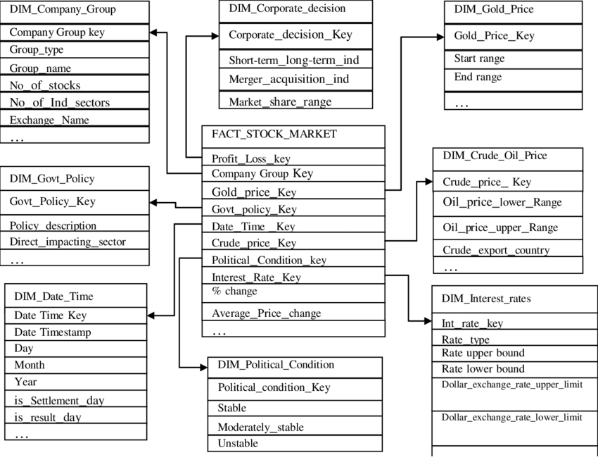

Given the Problem.

Create the Entity diagram and do datamodelling.
And tell relation betweem them.

We want to do this, so that after this
can simply able to create tables in database.

Learning of one interview.

