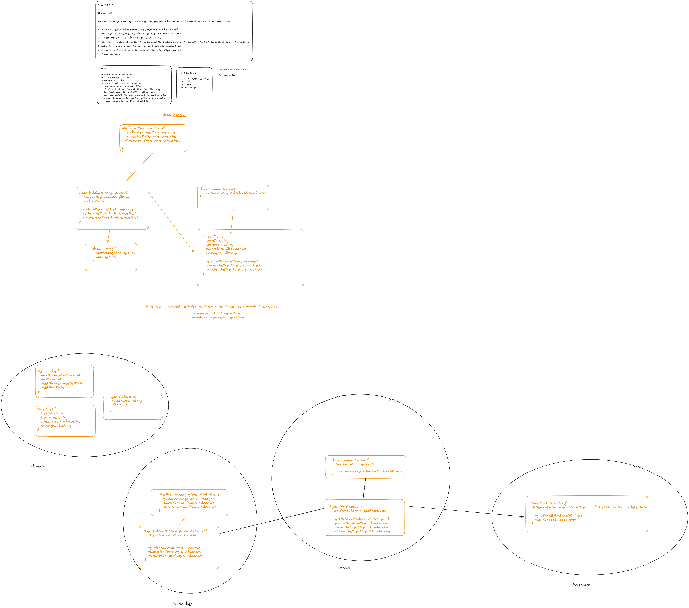

For e.g. Kafka

Develop message queue with push/pull model.

It will be same as pub-sub except:

1. Not stratedy in subscriber.
2. Only single notify method in subscriber usecase.
3. Consumer will call a method with topic and subscriber id.

Design(For understand , though we can combine this in single, by creating another controller and usecase statedy could be polling etc sort of):

