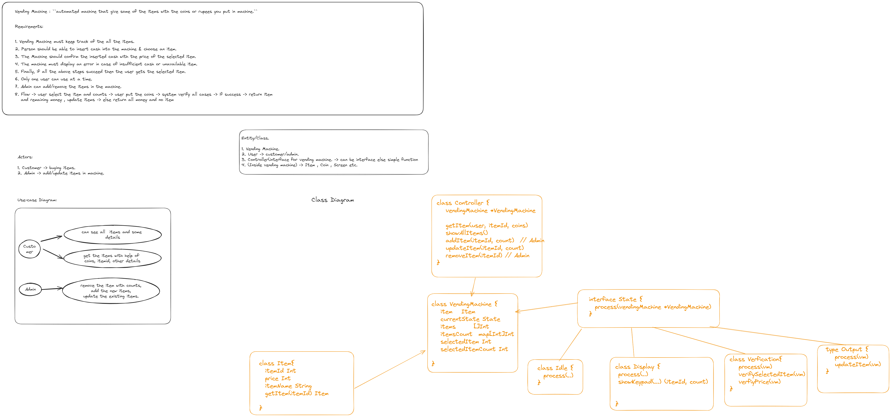

Vending Machine : ``automated machine that give some of the items with the coins or rupees you put in machine.``

Requirements:

1. Vending Machine must keep track of the all the items.
2. Person should be able to insert cash into the machine & choose an item.
3. The Machine should confirm the inserted cash with the price of the selected item.
4. The machine must display an error in case of insufficient cash or unavailable item.
5. Finally, if all the above steps succeed then the user gets the selected item.
6. Only one user can use at a time.
7. Admin can add/remove the items in the machine.
8. Flow -> user select the item and counts -> user put the coins -> system verify all cases -> if success -> return item and remaining money , update items -> else return all money and no item

``Since this is not that complex not maintaining repository and usecase for item and counts. Instead -> vending machine itself having list of items and its count data. And allowing model itself implementing methods``

Design Pattern: State

Optimisations:
1. MVC architecture.
2. Vending can be singleton.

Design:

