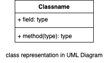

Once we have relational modeling. We can take hint with it and draw the object oriented design.

https://ujjwalbhardwaj.me/post/low-level-design-design-an-atm-system/
Template
- All class will map to that relational model.
- Those which we are pointing as foreign key , instead of that we will have its object.
- When ever we have different value for a particular column, we can use the interface. (rule condition).
- Apart from this , there are different design pattern which are not very specific to attribute but can use in constructure and methods.
- if not making relational model 
    - Ask the doubts and clear the requirements.
    - Figure our actors and some functionality with usecase diagram. (Not compulsory). https://akhileshmj.medium.com/lld-2-uml-diagrams-8d80e9b41256
    -  
    - Extend => different types (interface), includes one functionality calling other for completion.
    - Figure out Entities -> Can use top down approach. (Make this in consideration with relational as well , mean feasible in database and efficient as well)
    - Make class diagram with attribute and function(most this will be getter and setter). Make this part inconsideration with schema design ( in term of golang these are models, don't have much methods , repo and usecase layer talke in this)
    
    
    
    
    
    - Make interface (two heading, once has name interface in <<>>) and abstract class (only ittalic)
    - figure our relation and update those class diagram
    - is a relation => inheritance.
    
    - has a relation -> Association 
    
        - Composition => existance depend on other.
        - Aggregation => existance not depend on other.
    - Find the cardinality relation
    - 1:m, m:1, 1:1, m:m
    
    - Combine all and draw class diagram
    
    - put these classes in model directory.
    - Now for the methods part ( like book hotel etc ) -> create the below classes ( i do follow -> controller /(dto) usecase /(model) repo)
    - create repo directory, usecase, controller and use different design pattern here, in interivew you can combine some layer into 1 or 2, but tell in real life they are separated
    - controller -> usecase -> usecase/repo 
    - draw the complete class for one flow like its controller, usecase, repo and if have time then others.
    - repo fetch data from db and convert into models and return those model to usecase. Kind of object betweem usecase and repo.
    - usecase do business logic etc -> return that model to controller.
    - controller change that structure to dto and return to client.
    - Yeah that's pretty much
    - Now go to problem sets and do the lld design of them.
    

